<p align="center">
  
</p>

Elite Recruitment adds a single court decision — **Recruit an Elite Specialist** — that
opens a short menu where you choose the recruit's sex (where your laws and faith permit a
choice) and then their council role: **Marshal**, **Steward**, **Chancellor**, **Spymaster**,
or **Court Chaplain**. Each costs **Gold** plus a fitting secondary currency — **Prestige**
for the secular advisors, **Piety** for the court chaplain. The menu uses your realm's own
council titles, so a Tibetan-Buddhist ruler picks from **Chief Minister**, **Treasurer**, and
**Chief Diviner** rather than the generic English names.

<p align="center">
  <a href="docs/decisions.jpg">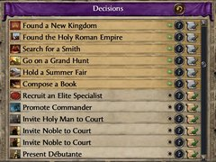</a>
  <a href="docs/gender-picker.jpg">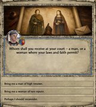</a>
  <a href="docs/role-picker.jpg">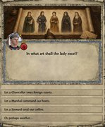</a>
</p>

<p align="center"><sub><em>Recruit arrivals — court order (Chancellor · Marshal · Steward · Spymaster · Chaplain), male then female:</em></sub></p>

<p align="center">
  <a href="docs/chancellor-male.jpg">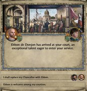</a>
  <a href="docs/chancellor-female.jpg">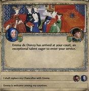</a>
  <a href="docs/marshal-male.jpg">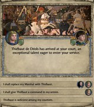</a>
  <a href="docs/marshal-female.jpg">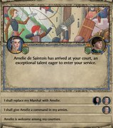</a>
  <a href="docs/steward-male.jpg">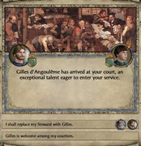</a>
  <a href="docs/steward-female.jpg">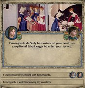</a>
  <a href="docs/spymaster-male.jpg">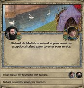</a>
  <a href="docs/spymaster-female.jpg">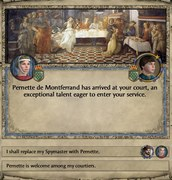</a>
  <a href="docs/chaplain-male.jpg">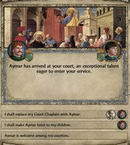</a>
  <a href="docs/chaplain-female.jpg">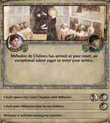</a>
</p>

<p align="center"><sub><em>Screenshots taken with the <a href="https://steamcommunity.com/sharedfiles/filedetails/?id=3054987840">Proper 4K UI Project</a> mod enabled.</em></sub></p>

## What it does

Crusader Kings II's vanilla **Promote Commander** decision can already turn up a strong —
even legendary — commander. Elite Recruitment delivers that same high-end commander, and
extends the idea to **stewards**, **chancellors**, **spymasters**, and a **court chaplain**:
vanilla's "Invite Noble to Court" only brings in an ordinary courtier, so a *guaranteed
elite* specialist in any of those roles has no real vanilla counterpart. Each comes with a
clean, deliberate **male vs. female** choice instead of leaving the recruit's gender up to
the game:

- The **male** option is available to most realms.
- The **female** option appears for realms whose laws or faith support women holding that
  post. A brought-in courtier is unrelated and unlanded, and for most roles vanilla only
  seats such a woman on the council (or in command) under full gender equality (or an
  equal/matriarchal faith) — so the Female Marshal, Steward, and Chancellor share that
  gate. The **Female Spymaster** is available more widely (pagan-group realms and the
  Cathar/Messalian faiths allow it without those laws), while the **chaplain** is gated by
  faith instead: a court chaplain must belong to a religion that ordains the recruit's sex,
  so the Female Chaplain appears only for faiths that ordain women (Catholicism, for one,
  does not).

So you choose the recruit that fits your realm, rather than the game choosing for you.

On arrival, a pop-up offers to **seat the recruit in their council role on the spot**,
replacing the current officeholder if the seat is filled. A Marshal can instead be given an
**army command**, and a Court Chaplain can be made **court physician** (The Reaper's Due) or
**court tutor** (Conclave) when suited.

### The recruits

**Marshals** are elite tacticians — guaranteed a large **Martial** boost (plus a smaller
lift to their other skills), the **Brilliant Strategist** education, and a **battlefield
leadership** trait (defensive leader, flanker, siege leader, etc.).

**Stewards** are elite administrators — guaranteed a large **Stewardship** boost (plus a
smaller lift to their other skills) and **Midas Touched**, the top stewardship education.

**Chancellors** are elite envoys — guaranteed a large **Diplomacy** boost (plus a smaller lift
to their other skills) and **Grey Eminence**, the top diplomacy education.

**Spymasters** are elite intriguers — guaranteed a large **Intrigue** boost (plus a smaller
lift to their other skills) and **Elusive Shadow**, the top intrigue education.

**Court chaplains** are elite theologians — guaranteed a large **Learning** boost (plus a
smaller lift to their other skills) and **Mastermind Theologian**, the top learning education.

#### Flavor rolls

On top of that, every recruit gets a **weighted "flavor" roll** that adds a little
personality — tuned so it *adds* character without changing what they fundamentally are:

- **Most of the time** you get something small and fitting — a touch more of their core
  skill, or a relevant trait (Duelist, Hunter, or Strong for marshals; Administrator,
  Architect, Gardener, or Temperate for stewards; Gregarious, Kind, or Honest for chancellors;
  Deceitful, Schemer, or Cynical for spymasters; Theologian, Mystic, Erudite, or Scholar for chaplains).
- **Occasionally** something bigger or quirkier appears. These surprises are intentionally rare.
- **Rarely**, if you carry a bloodline that *inspires commanders*, a marshal recruit can
  be a **legendary, named hero** — a unique nickname and a stronger set of traits. Likewise,
  if your realm has a **wonder that inspires learning** (a great library, House of Wisdom),
  a chaplain recruit picks up extra scholarly traits.
- A **marshal** may also carry the **marks of old battles** — a hardened scar, or (with The
  Reaper's Due) a lost eye or a disfiguring wound — always paired with a fitting trait, such
  as hard-won patience or a battle-born temper.
- Recruits also pick up **faith-appropriate touches** where they fit (a caste trait for
  Indian religions, a zodiac sign for astrological faiths, and so on), and a marshal may
  turn up a **holy-war veteran** trait matching their faith (Crusader, Mujahid, and the like).

## Game rules

Elite Recruitment adds two **game rules** under the "Various" filter, so you can tailor the mod to your campaign.

<p align="center">
  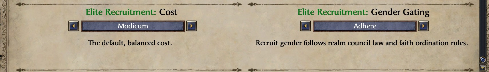
</p>

<p align="center">
  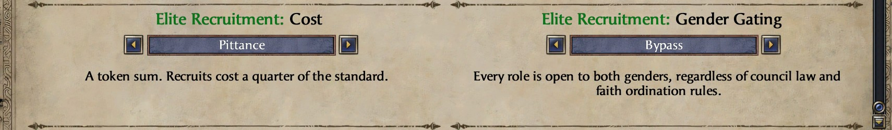
</p>

**Elite Recruitment: Cost** — sliding scale:

> Pittance · Trifle · **Modicum** (default) · Bounty · Fortune · Disabled

- **Disabled** turns off the recruitment decision.
- The tiers scale all costs together by a shared multiplier: **Pittance ×0.25 · Trifle ×0.5 ·
  Modicum ×1 · Bounty ×2 · Fortune ×4**.

Costs are tuned per council role, so each office has its own flavor:

- **Steward** — pure coin: the heaviest gold cost, only a token Prestige.
- **Spymaster** — more gold than Prestige.
- **Marshal** — balanced gold and Prestige.
- **Chancellor** — more Prestige than gold.
- **Court Chaplain** — mostly Piety, with a little gold.

**Gold** is charged as a **fraction of your yearly income** (so it scales with your realm), with
a **minimum floor in gold** so the price stays meaningful for low-income rulers — for most small
and mid realms, the floor is what you actually pay.

**Gold cost** — % of yearly income (minimum gold floor in parentheses):

| Role | Pittance | Trifle | Modicum | Bounty | Fortune |
|---|---|---|---|---|---|
| Steward | 25% (12) | 50% (25) | 100% (50) | 200% (100) | 400% (200) |
| Spymaster | 18.75% (10) | 37.5% (20) | 75% (40) | 150% (80) | 300% (160) |
| Marshal | 12.5% (8) | 25% (15) | 50% (30) | 100% (60) | 200% (120) |
| Chancellor | 6.25% (5) | 12.5% (10) | 25% (20) | 50% (40) | 100% (80) |
| Court Chaplain | 6.25% (5) | 12.5% (10) | 25% (20) | 50% (40) | 100% (80) |

**Secondary cost** — flat Prestige (secular advisors) or Piety (the chaplain):

| Role | Currency | Pittance | Trifle | Modicum | Bounty | Fortune |
|---|---|---|---|---|---|---|
| Steward | Prestige | 5 | 10 | 25 | 50 | 100 |
| Spymaster | Prestige | 10 | 25 | 50 | 100 | 200 |
| Marshal | Prestige | 25 | 50 | 100 | 200 | 400 |
| Chancellor | Prestige | 35 | 75 | 150 | 300 | 600 |
| Court Chaplain | Piety | 35 | 75 | 150 | 300 | 600 |

**Elite Recruitment: Gender Gating** — whether council roles are gated
by realm council law and faith ordination:

> **Adhere** (default) · Bypass

- **Adhere** keeps the existing eligibility gates.
- **Bypass** lets you recruit either gender for any role, regardless of gender restrictions from council law or faith.

## Requirements

### Base game

- **Crusader Kings II `3.3.x`.** The base game is all you need — nothing below is required.

### Optional DLC

Several optional flourishes appear only if you own the relevant DLC. Without it, that content
is skipped and the mod still works:

- **Holy Fury** — without it, recruits skip legendary, named marshals (which appear only when the ruler carries an *inspire commanders* bloodline), warrior-lodge sponsorship, and faith flavor (zodiac signs, reformed-pagan traits).
- **Jade Dragon** — without it, marshal recruits skip the Chinese "Way of the…" commander traits.
- **Rajas of India** — without it, recruits skip the Indian flavor (a caste trait and *War Elephant Leader* for marshals).
- **The Reaper's Due** — without it, marshal recruits skip rare battle wounds (a lost eye or a disfiguring wound).

## Installation

**Steam Workshop** (recommended): [**Elite Recruitment**](https://steamcommunity.com/sharedfiles/filedetails/?id=3740738464).

**Manual install:** copy the `EliteRecruitment` folder and `EliteRecruitment.mod` into:

```
Documents/Paradox Interactive/Crusader Kings II/mod/
```

…then enable **Elite Recruitment** in the launcher.

### Sub-mods

Two optional companion sub-mods ship alongside the base mod. Manual install is the same as the base mod.

- **Elite Recruitment - Proper4KUI Patch** — [Steam Workshop](https://steamcommunity.com/sharedfiles/filedetails/?id=3740747484). Hi-res versions of the decision icon and the 13 event banners, sized to match Proper4KUI's larger UI.
- **Elite Recruitment - Debug** — console `event ERD.*` events for hard-to-reach test paths (currently just `ERD.1` for legendary-commander bloodline grants).

## Compatibility

Elite Recruitment works on plain vanilla and adds only new content (it doesn't overwrite
base-game files), so it's friendly with most mods.

### CleanSlate

Already handled. This mod ships with `dependencies = { "CleanSlate" }` declared, so it
works with CleanSlate enabled and on plain vanilla.

Trait IDs are also auto-adapted. CleanSlate renames several traits (physique, beauty,
some leadership traits like *Battlefield Terrain Master* and the terrain experts) and
sets a `cleanslate_active` global flag at startup. When that flag is present, this mod
uses CleanSlate's trait names instead of vanilla's. **CleanSlate users — make sure
you're on the latest version from [GitHub](https://github.com/ck2plus/CleanSlate)** —
the startup flag is a recent addition. On an older CleanSlate that lacks it, the mod
still works. Recruits just won't roll those renamed trait variants.

## Community

- **[Steam Workshop discussions](https://steamcommunity.com/sharedfiles/filedetails/?id=3740738464)** — pinned welcome thread, comments, bug reports.
- **[Paradox forum thread](https://forum.paradoxplaza.com/forum/threads/mod-elite-recruitment.1927182/)** — CK2 user modifications subforum.
- **[GitHub Issues](https://github.com/imposterzed/EliteRecruitment/issues/new/choose)** — structured templates for bug reports, compatibility issues, and feature requests.
- **[GitHub Discussions](https://github.com/imposterzed/EliteRecruitment/discussions)** — general questions and discussion.

## For modders

### Detection

Two flags let other mods detect Elite Recruitment and the specialists it recruits:

- **Mod** — Elite Recruitment sets the global flag `elite_recruitment_active` at
  `on_startup` (on new games and on every save load). Check for it with
  `has_global_flag = elite_recruitment_active` — the same way Elite Recruitment detects
  CleanSlate's `cleanslate_active`.
- **Recruit** — Each recruit is tagged with a per-character flag —
  `elite_recruit_marshal`, `elite_recruit_steward`, `elite_recruit_chancellor`,
  `elite_recruit_spymaster`, or `elite_recruit_chaplain` — so you can match them with
  `has_character_flag`.

### error.log notes

CK2's static parser validates every trait ID in a trigger context — both `scripted_trigger` bodies and `limit = { ... }` blocks inside scripted_effects. The CleanSlate compat effects deliberately reference both vanilla and CleanSlate trait IDs across branches so the runtime picks the right one. The parser flags the inactive branch's IDs as "unknown trait" warnings. These are cosmetic. Runtime gating on `has_global_flag = cleanslate_active` ensures only the active stack's IDs are evaluated.

### Dev/test events

The **Elite Recruitment - Debug** sub-mod (see [Sub-mods](#sub-mods)) ships `event ERD.*` console events for hard-to-reach test paths. `event ERD.1 <charID>` grants a `legendary_commander_bloodline` (matrilineal for a female recipient).

## Development

The mod's script and localisation files (`.txt`, `.csv`) are kept as **UTF-8** in git for
readable, diffable accented text on GitHub, but **CK2 reads them as Windows-1252** — so
`.gitattributes` checks them out as **Windows-1252 with CRLF** line endings. Two things follow
for contributors:

- **Accented localisation edits must be saved as Windows-1252,** not UTF-8 — a UTF-8 save
  corrupts the accents once git reinterprets the bytes. Set your editor accordingly (in
  Notepad++: *Encoding → ANSI*, and *Edit → EOL Conversion → Windows (CR LF)*), or convert
  with a small script. Plain-ASCII edits are unaffected.
- **A UTF-8/LF editor may leave the file looking modified** with a *"LF will be replaced by
  CRLF"* notice — that's the expected line-ending reconciliation, not an error. Run
  `git add --renormalize .` before committing and confirm `git status` is clean.

Markdown (this README, the changelog) is plain UTF-8 and needs none of this.

## Credit & License

Elite Recruitment © 2026 imposterzed. MIT, see [LICENSE](LICENSE).

Arrival banner art is in the public domain. Sources:

| Banner | Work | Artist | Year | Source |
|---|---|---|---|---|
| Chancellor (male) | *Arrival of the English Ambassadors* (St Ursula cycle) | Vittore Carpaccio | 1495 | Gallerie dell'Accademia, Venice — [Wikimedia](https://commons.wikimedia.org/w/index.php?title=File:Accademia_-_Arrivo_degli_ambasciatori_inglesi_presso_il_re_di_Bretagna_di_Vittore_Carpaccio.jpg&oldid=1004866913) |
| Chancellor (female) | Illumination from *Book of the Queen* — Christine de Pizan presenting to Queen Isabeau of Bavaria | Master of the Cité des Dames workshop (BL Harley 4431, fol. 3r) | c. 1410–14 | British Library — [Wikimedia](https://commons.wikimedia.org/w/index.php?title=File:Christine_de_Pisan_and_Queen_Isabeau_(2).jpg&oldid=1124296593) |
| Marshal (male) | *Niccolò Mauruzi da Tolentino at the Battle of San Romano* | Paolo Uccello | c. 1438–1440 | National Gallery, London — [Wikimedia](https://commons.wikimedia.org/w/index.php?title=File:San_Romano_Battle_%28Paolo_Uccello%2C_London%29_01.jpg&oldid=1041440407) |
| Marshal (female) | *Jeanne d'Arc à la porte Saint-Honoré lors du siège de Paris de 1429* | Anonymous (from Martial d'Auvergne, *Vigiles du roi Charles VII*) | c. 1484 | BnF ms. Français 5054, fol. 66v — [Wikimedia](https://commons.wikimedia.org/w/index.php?title=File:Le_si%C3%A8ge_de_Paris_en_1429_par_Jeanne_d%27Arc_-_Martial.jpg&oldid=1102676135) |
| Steward (male) | *The Village Lawyer* (also *The Payment of the Tithes*) | Pieter Brueghel the Younger | 1621 | Museum of Fine Arts Ghent (MSK) — [Wikimedia](https://commons.wikimedia.org/w/index.php?title=File:Pieter_Brueghel_the_Younger_-_Village_Lawyer_-_WGA3633.jpg&oldid=1075665833) |
| Steward (female) | Illumination from *La Cité des Dames* | Master of the Cité des Dames (BnF ms. Français 607, fol. 2) | c. 1450 | Bibliothèque nationale de France — [Wikimedia](https://commons.wikimedia.org/w/index.php?title=File:Meister_der_%27Cit%C3%A9_des_Dames%27_002.jpg&oldid=605848094) |
| Spymaster (male) | *Assassinat de Sigebert Ier* (Grandes Chroniques de France, BnF Fr. 6465, fol. 25) | Jean Fouquet | c. 1455–60 | Bibliothèque nationale de France — [Wikimedia](https://commons.wikimedia.org/w/index.php?title=File:Assassinat_de_Sigebert_Ier.jpg&oldid=1067059001) |
| Spymaster (female) | *Herod's Banquet* (Salome's Dance) | Fra Filippo Lippi | 1452–65 | Prato Cathedral fresco — [Wikimedia](https://commons.wikimedia.org/w/index.php?title=File:Fra_Filippo_Lippi_-_Herod%27s_Banquet_-_WGA13286.jpg&oldid=1033447971) |
| Chaplain (male) | *St Peter Preaching in the Presence of St Mark* (Linaioli Tabernacle predella) | Fra Angelico | c. 1433 | Museo di San Marco, Florence — [Wikimedia](https://commons.wikimedia.org/w/index.php?title=File:Fra_Angelico_-_St_Peter_Preaching_in_the_Presence_of_St_Mark_-_WGA00464.jpg&oldid=1170300133) |
| Chaplain (female) | *Saint Catherine of Alexandria and the Philosophers* | Masolino da Panicale | 1428–30 | Basilica di San Clemente, Rome — [Wikimedia](https://commons.wikimedia.org/w/index.php?title=File:Masolino,_santa_caterina_e_i_filosofi_di_alessandria,_san_clemente_roma.jpg&oldid=1038755711) |
