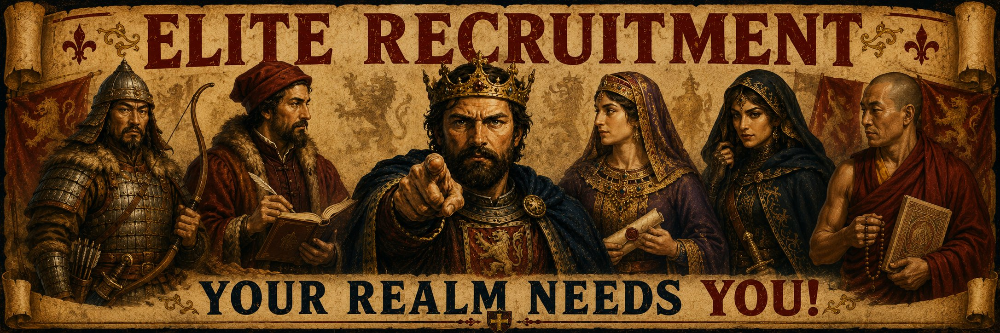
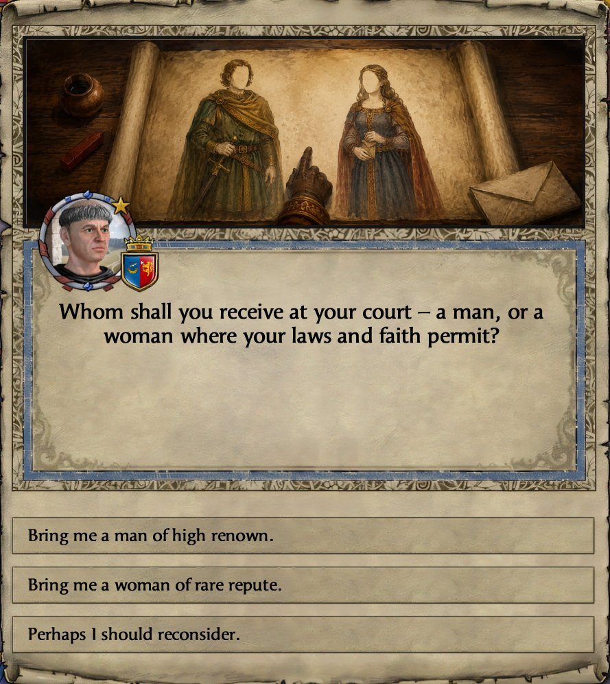
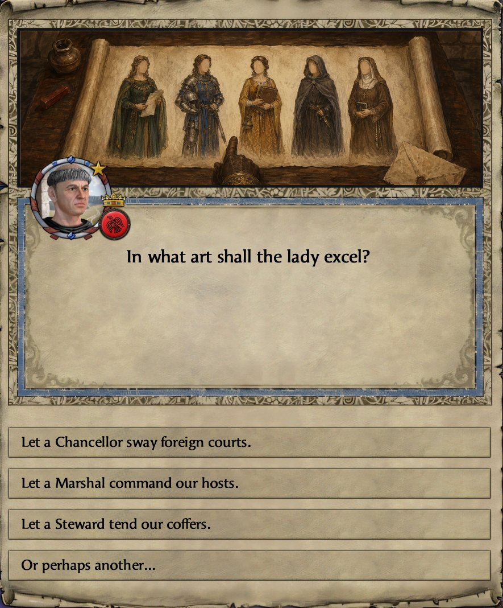
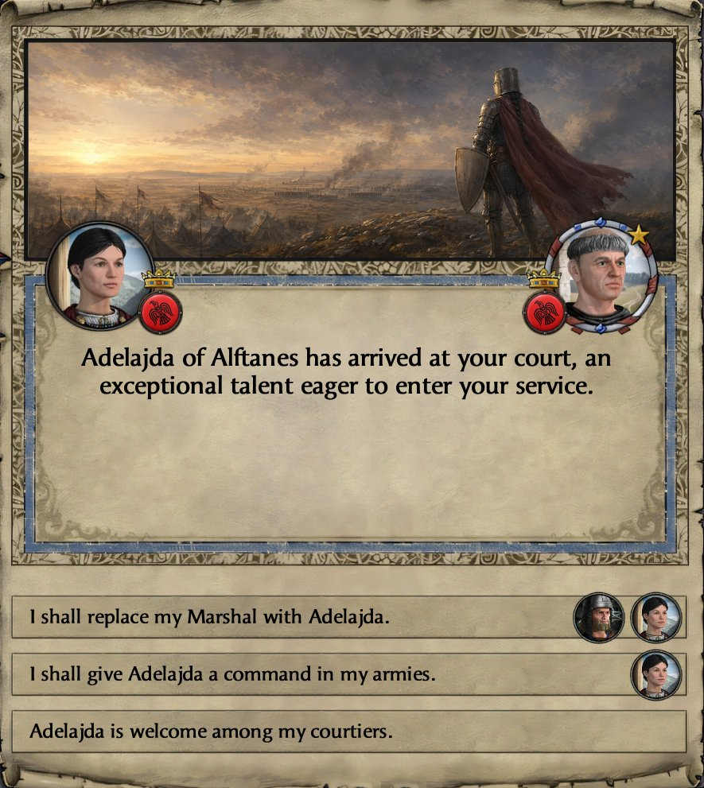

<p align="center">
  
</p>

Elite Recruitment adds a single court decision — **Recruit an Elite Specialist** — that
opens a short menu where you choose the recruit's sex (where your laws and faith permit a
choice) and then their council role: **Marshal**, **Steward**, **Chancellor**, **Spymaster**,
or **Court Chaplain**. Each costs **Gold** plus a fitting secondary currency — **Prestige**
for the secular advisors, **Piety** for the court chaplain. The menu uses your realm's own
council titles, so a Tibetan-Buddhist ruler picks from **Chief Minister**, **Treasurer**, and
**Chief Diviner** rather than the generic English names; the role-noun matches whatever your
council UI shows.

<p align="center">
  
  
  
  
</p>

<p align="center"><sub><em>Screenshots taken with the <a href="https://steamcommunity.com/sharedfiles/filedetails/?id=3054987840">Proper 4K UI Project</a> mod enabled.</em></sub></p>

## What it does

Crusader Kings II's vanilla **Promote Commander** decision can already turn up a strong —
even legendary — commander. Elite Recruitment delivers that same high-end commander, and
extends the idea to **stewards**, **chancellors**, **spymasters**, and a **court chaplain**:
vanilla's "Invite Noble to Court" only brings in an ordinary courtier, so a *guaranteed
elite* specialist in any of those roles has no real vanilla counterpart. Each comes with a
clean, deliberate **male vs. female** choice instead of leaving the recruit's gender up to
the game:

- The **male** option is available to most realms.
- The **female** option appears for realms whose laws or faith support women holding that
  post. A brought-in courtier is unrelated and unlanded, and for most roles vanilla only
  seats such a woman on the council (or in command) under full gender equality (or an
  equal/matriarchal faith) — so the Female Marshal, Steward, and Chancellor share that
  gate. The **Female Spymaster** is available more widely (pagan-group realms and the
  Cathar/Messalian faiths allow it without those laws), while the **chaplain** is gated by
  faith instead: a court chaplain must belong to a religion that ordains the recruit's sex,
  so the Female Chaplain appears only for faiths that ordain women (Catholicism, for one,
  does not).

So you choose the recruit that fits your realm, rather than the game choosing for you.

On arrival, a pop-up offers to **seat the recruit in their council role on the spot**,
replacing the current officeholder if the seat is filled. A Marshal can instead be given an
**army command**, and a Court Chaplain can be made **court physician** (The Reaper's Due) or
**court tutor** (Conclave) when suited.

## The recruits

**Marshals** are elite tacticians — guaranteed a large **Martial** boost (plus a smaller
lift to their other skills), the **Brilliant Strategist** education, and a **battlefield
leadership** trait (defensive leader, flanker, siege leader, etc.).

**Stewards** are elite administrators — guaranteed a large **Stewardship** boost (plus a
smaller lift to their other skills) and **Midas Touched**, the top stewardship education.

**Chancellors** are elite envoys — guaranteed a large **Diplomacy** boost (plus a smaller lift
to their other skills) and **Grey Eminence**, the top diplomacy education.

**Spymasters** are elite intriguers — guaranteed a large **Intrigue** boost (plus a smaller
lift to their other skills) and **Elusive Shadow**, the top intrigue education.

**Court chaplains** are elite theologians — guaranteed a large **Learning** boost (plus a
smaller lift to their other skills) and **Mastermind Theologian**, the top learning education.

### Flavor rolls

On top of that, every recruit gets a **weighted "flavor" roll** that adds a little
personality — tuned so it *adds* character without changing what they fundamentally are:

- **Most of the time** you get something small and fitting — a touch more of their core
  skill, or a relevant trait (Duelist, Hunter, or Strong for marshals; Administrator,
  Architect, Gardener, or Temperate for stewards; Gregarious, Kind, or Honest for chancellors;
  Deceitful, Schemer, or Cynical for spymasters; Theologian, Mystic, Erudite, or Scholar for chaplains).
- **Occasionally** something bigger or quirkier appears. These are intentionally rare, so
  your recruit almost always reads as "an excellent specialist," not a lottery prize.
- **Rarely**, if you carry a bloodline that *inspires commanders*, a marshal recruit can
  be a **legendary, named hero** — a unique nickname and a stronger set of traits. Likewise,
  if your realm has a **wonder that inspires learning** (a great library, House of Wisdom),
  a chaplain recruit picks up extra scholarly traits.
- A **marshal** may also carry the **marks of old battles** — a hardened scar, or (with The
  Reaper's Due) a lost eye or a disfiguring wound — always paired with a fitting trait, such
  as hard-won patience or a battle-born temper, so a scar is never just a penalty.
- Recruits also pick up **faith-appropriate touches** where they fit (a caste trait for
  Indian religions, a zodiac sign for astrological faiths, and so on), and a marshal may
  turn up a **holy-war veteran** trait matching their faith (Crusader, Mujahid, and the like).

The baseline is always "a reliably excellent specialist"; the random flavor is the
seasoning, never the main course.

## Game rules

Elite Recruitment adds a single **game rule**, so you can tailor it to your campaign. Set it on
the **Game Rules** screen when you start a new game (it lives under the "Various" group).

**Elite Recruitment** — one sliding-scale cost tier:

> Pittance · Trifle · **Modicum** (default) · Bounty · Fortune · Disabled

- **Disabled** turns off the recruitment decision.
- The tiers scale all costs together by a shared multiplier: **Pittance ×0.25 · Trifle ×0.5 ·
  Modicum ×1 · Bounty ×2 · Fortune ×4**.

Costs are tuned per council role, so each office has its own flavor:

- **Steward** — pure coin: the heaviest gold cost, only a token Prestige.
- **Spymaster** — more gold than Prestige.
- **Marshal** — balanced gold and Prestige.
- **Chancellor** — more Prestige than gold.
- **Court Chaplain** — mostly Piety, with a little gold.

**Gold** is charged as a **fraction of your yearly income** (so it scales with your realm), with
a **minimum floor in gold** so the price stays meaningful for low-income rulers — for most small
and mid realms, the floor is what you actually pay.

**Gold cost** — % of yearly income (minimum gold floor in parentheses):

| Role | Pittance | Trifle | Modicum | Bounty | Fortune |
|---|---|---|---|---|---|
| Steward | 25% (12) | 50% (25) | 100% (50) | 200% (100) | 400% (200) |
| Spymaster | 18.75% (10) | 37.5% (20) | 75% (40) | 150% (80) | 300% (160) |
| Marshal | 12.5% (8) | 25% (15) | 50% (30) | 100% (60) | 200% (120) |
| Chancellor | 6.25% (5) | 12.5% (10) | 25% (20) | 50% (40) | 100% (80) |
| Court Chaplain | 6.25% (5) | 12.5% (10) | 25% (20) | 50% (40) | 100% (80) |

**Secondary cost** — flat Prestige (secular advisors) or Piety (the chaplain):

| Role | Currency | Pittance | Trifle | Modicum | Bounty | Fortune |
|---|---|---|---|---|---|---|
| Steward | Prestige | 5 | 10 | 25 | 50 | 100 |
| Spymaster | Prestige | 10 | 25 | 50 | 100 | 200 |
| Marshal | Prestige | 25 | 50 | 100 | 200 | 400 |
| Chancellor | Prestige | 35 | 75 | 150 | 300 | 600 |
| Court Chaplain | Piety | 35 | 75 | 150 | 300 | 600 |

## Requirements

### Base game

- **Crusader Kings II `3.3.x`.** The base game is all you need — nothing below is required.

### Optional DLC

Several optional flourishes appear only if you own the relevant DLC. Without it, that content
is simply skipped — the mod still works:

- **Holy Fury** — legendary, named marshals (when the ruler carries an *inspire commanders*
  bloodline), warrior-lodge sponsorship and the lodge's command trait, and faith flavor
  (zodiac signs, reformed-pagan traits).
- **Jade Dragon** — Chinese "Way of the…" commander traits for Chinese-culture realms.
- **Rajas of India** — Indian flavor: a caste trait and the *War Elephant Leader* trait.
- **The Reaper's Due** — rare marshal battle wounds (a lost eye or a disfiguring wound).

## Installation

Copy the `EliteRecruitment` folder and `EliteRecruitment.mod` into:

```
Documents/Paradox Interactive/Crusader Kings II/mod/
```

…then enable **Elite Recruitment** in the launcher.

**Proper4KUI users:** also install the **Elite Recruitment - Proper4KUI Patch** companion
sub-mod for a 50×50 hi-res version of the decision icon, pixel-flush with Proper4KUI's
larger UI. Vanilla players don't need it.

## Compatibility

Elite Recruitment works on plain vanilla and adds only new content (it doesn't overwrite
base-game files), so it's friendly with most mods.

### Overhauls

Larger overhauls typically use `replace_path` in their `.mod` file to take over shared
folders (`decisions/`, `events/`, `localisation/`, …). If this mod loads before the
overhaul, those `replace_path` claims wipe this mod's content from the affected folders.
The fix is a `dependencies = { "OverhaulName" }` line in this mod's `.mod` file — purely
a load-order hint telling the launcher to load the overhaul first. Dependencies are not
hard requirements; if the overhaul isn't installed, the line is silently ignored.

For overhaul support, please open an issue.

#### CleanSlate

Already handled. This mod ships with `dependencies = { "CleanSlate" }` declared, so it
works with CleanSlate enabled and on plain vanilla.

Trait IDs are also auto-adapted. CleanSlate renames several traits (physique, beauty,
some leadership traits like *Battlefield Terrain Master* and the terrain experts) and
sets a `cleanslate_active` global flag at startup; when that flag is present, this mod
uses CleanSlate's trait names instead of vanilla's. **CleanSlate users — make sure
you're on the latest version from [GitHub](https://github.com/ck2plus/CleanSlate)** —
the startup flag is a recent addition. On an older CleanSlate that lacks it, the mod
still works; recruits just won't roll those renamed trait variants.

## For modders

Two flags let other mods detect Elite Recruitment and the specialists it recruits:

- **Detect the mod.** Elite Recruitment sets the global flag `elite_recruitment_active` at
  `on_startup` (on new games and on every save load). Check for it with
  `has_global_flag = elite_recruitment_active` — the same way Elite Recruitment detects
  CleanSlate's `cleanslate_active`.
- **Identify a recruit.** Each recruit is tagged with a per-character flag —
  `elite_recruit_marshal`, `elite_recruit_steward`, `elite_recruit_chancellor`,
  `elite_recruit_spymaster`, or `elite_recruit_chaplain` — so you can match them with
  `has_character_flag`.

**Dev/test events.** Hard-to-reach paths (legendary bloodlines, SCM-gap edges, etc.) have
console-grant helpers in a sibling sub-mod, **Elite Recruitment - Debug**. Enable it in the
launcher alongside Elite Recruitment to use the `ERD.*` events — e.g.
`event ERD.1 <charID>` grants `legendary_commander_bloodline`. The base mod doesn't ship
these events.

## Development

The mod's script and localisation files (`.txt`, `.csv`) are kept as **UTF-8** in git for
readable, diffable accented text on GitHub, but **CK2 reads them as Windows-1252** — so
`.gitattributes` checks them out as **Windows-1252 with CRLF** line endings. Two things follow
for contributors:

- **Accented localisation edits must be saved as Windows-1252,** not UTF-8 — a UTF-8 save
  corrupts the accents once git reinterprets the bytes. Set your editor accordingly (in
  Notepad++: *Encoding → ANSI*, and *Edit → EOL Conversion → Windows (CR LF)*), or convert
  with a small script. Plain-ASCII edits are unaffected.
- **A UTF-8/LF editor may leave the file looking modified** with a *"LF will be replaced by
  CRLF"* notice — that's the expected line-ending reconciliation, not an error. Run
  `git add --renormalize .` before committing and confirm `git status` is clean.

Markdown (this README, the changelog) is plain UTF-8 and needs none of this.

## License

Elite Recruitment © 2026 imposterzed — released under the **MIT License** (see [`LICENSE`](LICENSE)).
You're free to use, modify, and redistribute it; just keep the copyright and license notice.
